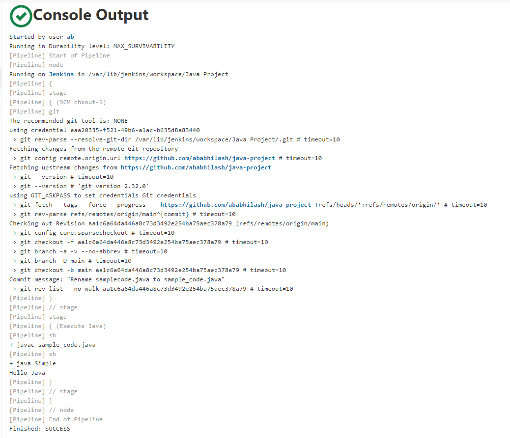
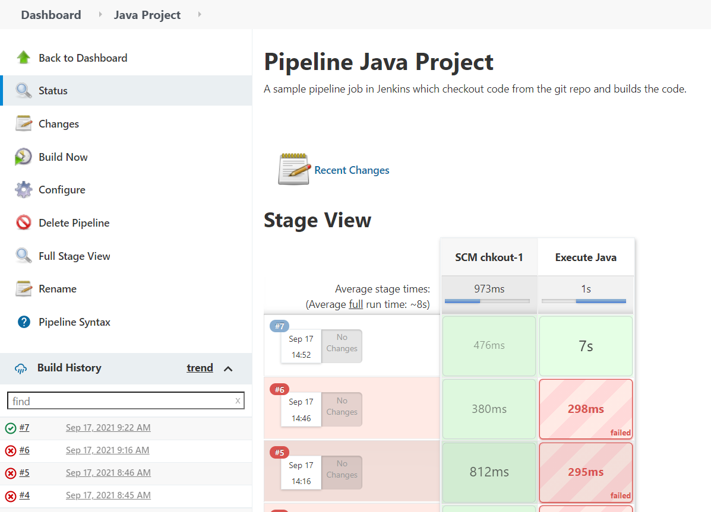

# java-project
A sample pipeline job in Jenkins which checkout code from the git repo and builds the code.

<h2 class="code-line" data-line-start=1 data-line-end=2 >Output1</h2>

<h2 class="code-line" data-line-start=4 data-line-end=5 >Output2</h2>

