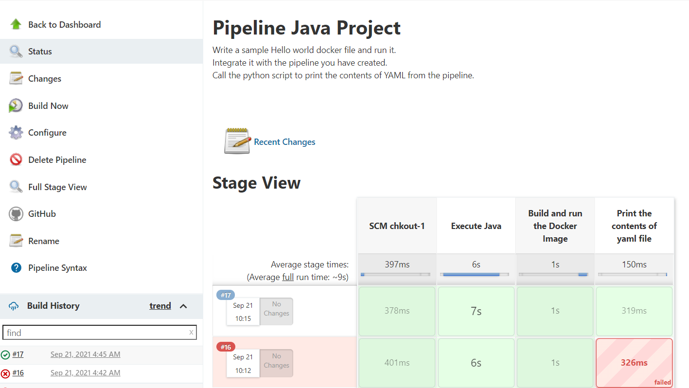
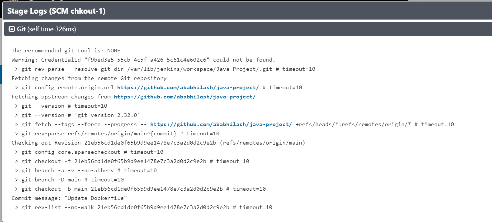
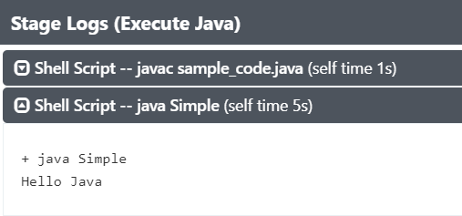
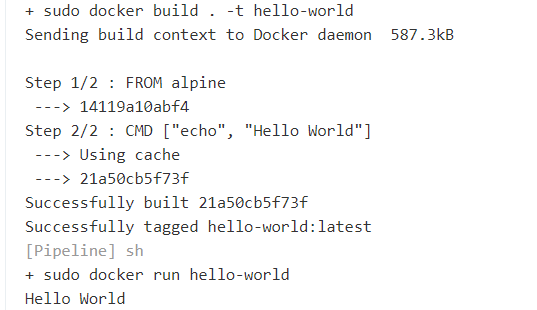
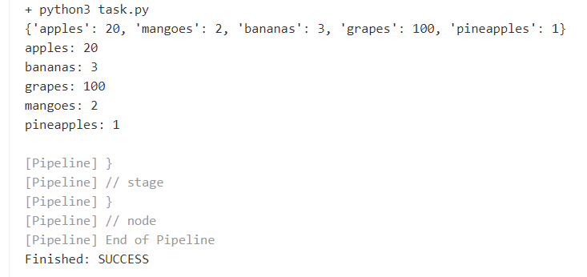

# java-project
### 1) Write a sample Hello world docker file and run it.
### 2) Integrate it with the Jenkinspipeline.
### 3) Call the python script to print the contents of yaml from the pipeline.

<h2 class="code-line" data-line-start=1 data-line-end=2 >Output</h2>
<h3 class="code-line" data-line-start=3 data-line-end=4 >Output1:</h3>

<h3 class="code-line" data-line-start=6 data-line-end=7 >Output2:</h3>

<h3 class="code-line" data-line-start=9 data-line-end=10 >Output3:</h3>

<h3 class="code-line" data-line-start=12 data-line-end=13 >Output4:</h3>

<h3 class="code-line" data-line-start=15 data-line-end=16 >Output5:</h3>

